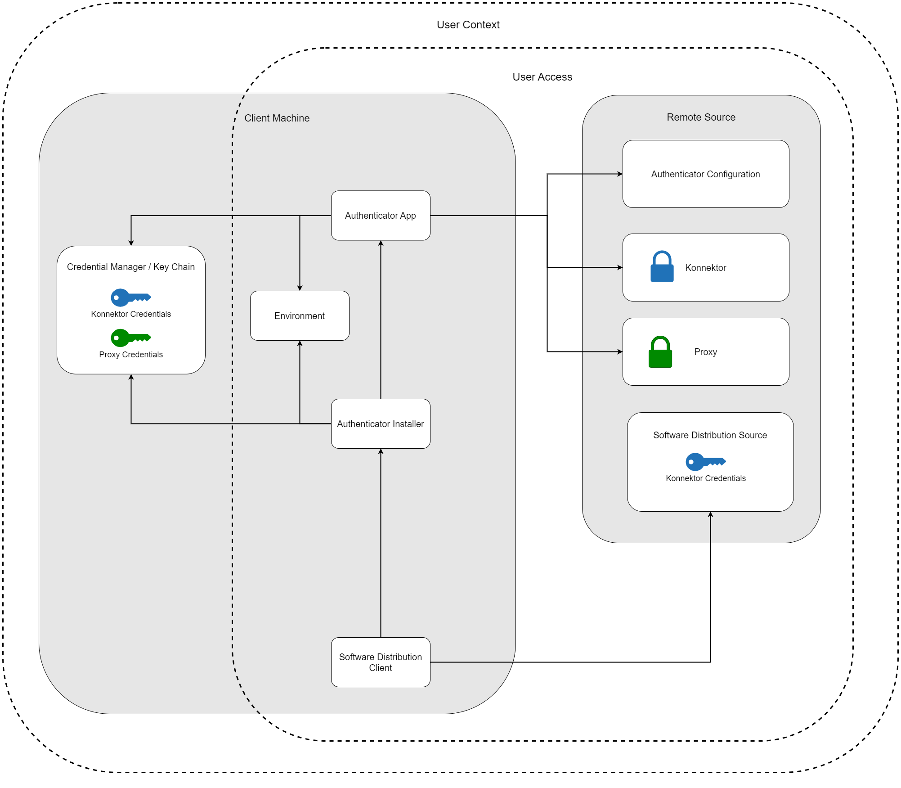
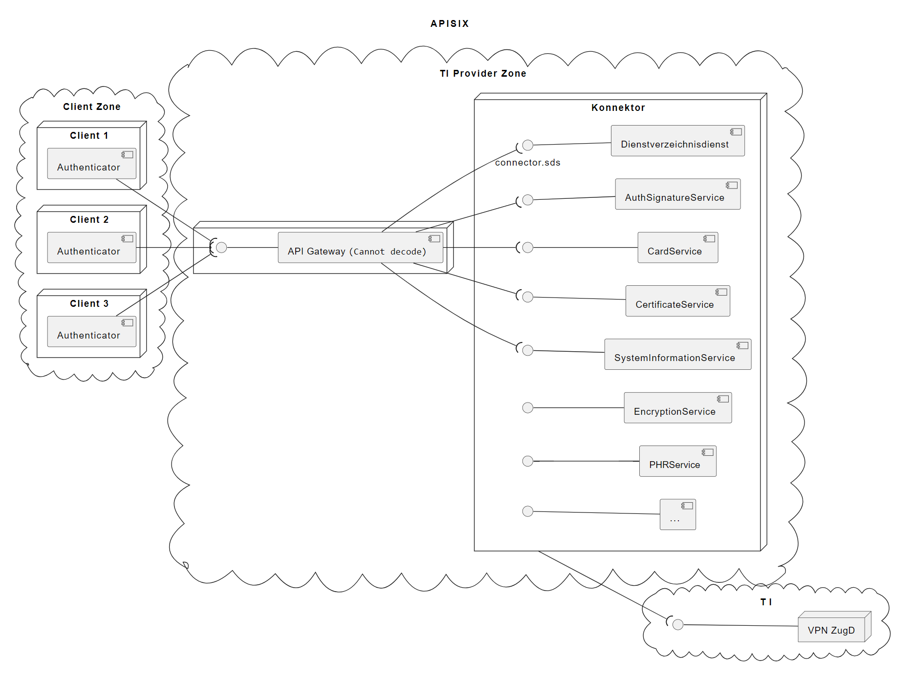

# Motivation
The Authenticator app is a client application that runs in the environment of hospitals and doctor's offices. In all of those cases, we do need a Konnektor and a smart card for the authentication process. The Konnektor however, has a protected API. The corresponding credentials are required by a caller, in our case, by the Authenticator app.

This situation raises some issues, because the credentials for the Konnektor API need a high protection level. And these credentials need to be supplied to decentralized client apps.
Our product team looked into different approaches to tackle this weakness.

## Sensitive Data

Currently, we do have several configuration data that have an elevated protection requirement.
* Credentials for the Konnektor API
* Proxy Credentials for the user

The scope of the sensitive data can be different, e.g. proxy credentials are related to the user where Konnektor credentials are related to the workplace.

## Configuration Basics

The configuration of the authenticator can be done for different installation scenarios.
If relevant for the protection scheme, we will look into the differences regarding the scenario.

# Holding Credentials in Configuration in Plain Text

The configuration file, either stored locally or remotely, holds all sensitive data in plain text. This was the initial design. 
Regarding the scenario, whether it is a local or central configuration, the access to the configuration file can be restricted on a operating system or network level.

## Assessment

The most single advantage of this scheme is the simplicity of the configuration.
The disadvantage is, that every authorized user can extract the credentials and use them in an unauthorized way.
Hence, we recommend not to use this mechanism.

# Use of Credential Manager / Keychain

The main idea behind this mechanism is to use existing protection schemes on the client machines. The Windows Credential Manager respective MacOS Keychain is the default credential manager by the operating system. We want to instrument this.

However, there are some caveats to this scheme, e.g. access to the credentials by other software. 
This is the system architecture regarding the sensitive data.

## Proof of Concept
An implementation can be found [here](./credential-manager/README.md)

## Mitigations
To address the problem regarding unauthorized access by other software and scripts, a Windows and MacOS system can be 
hardened regarding restrictive execution policies. 
* No scripts executable in the user context
* Only trusted Software is executable
* Software can only be run from specific directories, where further security policies are in place.

## Central Configuration
This configuration variant uses a central configuration file, that is not locally stored and most likely is not writable
by the Authenticator app.

### Distribution of Sensitive Data

The challenge of this scheme poses the distribution of the sensitive data, especially in central configuration scenarios. When users change their workplace, the data are required there as well, but might be different depending on the scope of the data. This fact increases the maintenance effort massively.

The distribution can be implemented by a script, that holds the credentials and can be distributed to the client machines via standard enterprise methods, like Microsoft inTune, Microsoft SCCM or Group Policy Objects. However, there are some potential privacy issues during the distribution. For more details, see

A distribution scheme could look like:

1. Preparation of a distributable script containing the sensitive data 
   2. Parameterization of the script
   3. (Optional) Compilation of the script is possible to mitigate plain text data in a file. This is not an actual security measure, but would require further reverse engineering techniques to retrieve the data. 
   4. Consider a privacy-friendly logging policy on the client machines. The data could be logged in the OS during the installation process.
2. The package needs to be distributed to the same users that received the authenticator installer
   1. If different credentials are used for different user groups or Konnektors, this needs to be reflected here.
   2. Distribution via Software Distribution System, e.g. Microsoft inTune, Microsoft System Center Configuration Manager (SCCM), Active Directory Group Policy Object
   3. Credentials are stored with particular names
   4. The software distribution system should reduce the access time for the clients to the minimum to reduce the risk of information leakage.
3. The Authenticator is started
   1. Central configuration is loaded
   2. Authenticator loads sensitive data from the Credential Manager/Keychain

An example of the script can be found [here](./credential-manager/store-credential.ps1)

### Integrity and Authenticity of the Script
We want both, integrity and authenticity ensured when delivering the script. That's why we should sign it. However, the parametrization of the script with the credentials of the hospitals would require a new signing by the hospital itself, so that the newly signed artifact can be rolled-out to the clients.

Nevertheless, we ensure integrity and authenticity on our script.

### Migration
The migration to the usage of the credential manager requires some changes on the target environments.

If the sensitive data still is stored in the configuration file, and in this scenario the Authenticator instances usually do not have write-access, changes from the IT departments are required:

1. Run the configuration depicted above
2. Removal of the credentials from the configuration files.
3. It is important, that only the IT department of the target environment is able to determine whether all clients are migrated. 

### Assessment
Besides the distribution, there are more potential weaknesses to this scheme. For example the 

There are definitively some residual risks, but in case the hospitals don't want to use further components for the authenticator app, we assess this scheme as sufficient, if some mitigations are in place.

## Local Configuration

In this scenario, the configuration takes place locally, most likely via the Authenticator Configuration UI. The sensitive data would just be written into the credential manager resp. keychain.

A local migration from the configuration file is possible since the Authenticator has write-access to the configuration file. This could be done automatically or manually via the configuration UI.

### Assessment

The usage of the credential manager seems to be more fitting for local configuration scenarios. The user's workplace is not fluent and hence, the maintenance effort is low. However, access to the sensitive data by other software installed on the client machine is still given. See [Mitigations](#mitigations) for help.

# Konnektor Facade
The idea of a facade is to move the Konnektor credentials from the client configuration to a central component. Furthermore, this component could
restrict the exposed endpoints of the Konnektor to the ones, that are required by the Authenticator.

We use APISIX as an API Gateway to show the scheme.

## Proof of Concept
An implementation can be found [here](./api-gateway-poc/README.md)

## 1-to-1 relation of Facade and Konnektor?
In our PoC, we used one API Gateway for one Konnektor.
Obviously, this is not necessarily the best solution for every environment since most of the target environments use several to many Konnektors.

However, there are several solutions to address this topic. Some basic ideas are:
* In the current set up on many target environments, Konnektors and card terminals are related actual workplaces. One could transform this relationship
to a source IP address range or list to a specific Konnektor in the facade configuration. Using APISIX, it is possible to create origin specific policies. 
This could be instrumented to route the request to the correct Konnektor.
* Distinguish the targets by different user credentials in the facade and redirect to the correct Konnektor accordingly.
* ...

If you have more ideas, please share them with us. We will check them and add them to our documentation for other users.

## Credentials Storage
The credentials are stored either in the facade itself or in an integrated HSM which can be accessed by the facade. In our example we simply configure basic authentication for the facade.

## Authentication
Whether the facade needs authentication itself is up to the users. Some key considerations are:
* The authentication credentials need to be distributed to the client machines. This would not enhance maintainability, but only security regarding the Konnektor credentials.
* The authentication could be integrated with the enterprise IAM of the target environment. We don't have a PoC for that, but there are plugins for support of common IAM solutions like AD.

## Assessment
This architecture solves all problems of the previous schemas. No sensitive credentials on the client-side. No distribution of highly sensitive information across a wide and complex infrastructure.
The API Gateway as a central component is much easier to protect and monitor than decentralized clients in a heterogen environment.
However, it demands additional configuration and maintenance, since it is an additional component which is critical. 
Furthermore, the IT department needs specific skills for configuring the API Gateway.

Nevertheless, we recommend the usage of this scheme. 

# FAQ for Credential Manager Usage
## Can I see the credentials in the credential manager?
Not per se. The credentials themselves can only be changes or removed in the UI. However, a program or script in the user context is able to retrieve the data
just as the Authenticator app is doing it. For help, see [Mitigations](#mitigations)

## Why don't we just encode the credentials in the configuration file?
This would not add security (Security by Obscurity). Since our code and documentation is public, an attacker would immediately know what to do without specific skills.

## How can the distribution of credentials be supported in large environments?
This depends strongly on the target environment. We showed several solutions, that have distinguished advantages and caveats. 
Our goal is to present this to the users, so that they can make an informed decision.

## Why can't we encrypt the script holding the credentials to be safe against reverse engineering attacks?
If we encrypt the script during packaging, we would need to decrypt it on the client machines to retrieve the credentials. We are not aware of any keys that are present on the clients that can be used for that.
However, this depends on the target environment. If clients have such keys, they could decrypt it. Nevertheless, in this case the IT department would need to ensure,
that an attacker cannot access this key as well. Otherwise, this would not add security, but complexity.

## Why don't we add a key to the Authenticator app that encrypts and decrypts the configuration file?
We don't want to use hard-coded credentials in our app. This would mean, that all tenants have the same key and the binary holding the key is publicly accessible. 