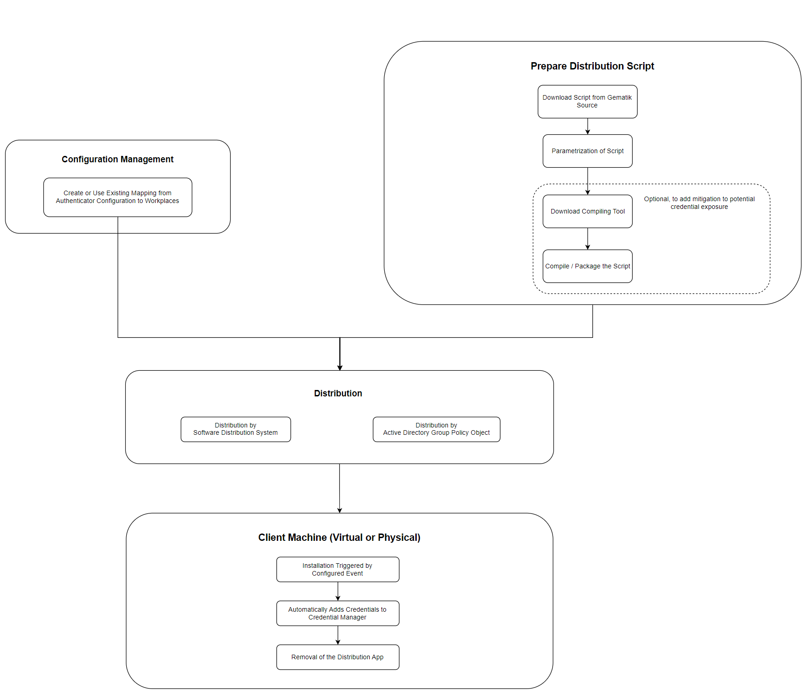

# Storing Credentials Securely
The Authenticator has to deal with credentials of other systems, like the Konnektor API or a company proxy with authentication. We want to avoid plaintext secrets in our configuration. Therefore, we instrument the Windows Credential Manager, which holds the credentials configured in the UI of the Authenticator.

Once, the credentials are put into the Credential Manager, we look for the following values:
* Gematik_Authenticator/Connector_BasicAuth: Username + Password
* Gematik_Authenticator/Connector_ClientCert_Password: Password
* Gematik_Authenticator/Proxy_BasicAuth: Username + Password

Depending on the installation scenario, there are some challenges we want to address.

## Usage in Central Configuration
Using a central configuration means, that the configuration does not take place on the machine itself, but relies on a remote configuration file. We don't want to have the credentials in that configuration, thus we need to provide it to the machines.

The following process is an example, how the distribution of a credential installation app could work:

## Prerequisites
Please make sure, that the client's machine is able to run the script or compiled app. This might require temporary changes on the execution policies.

Test this on a real client machine.

A proposal for a script can be found here [Example Script](./store-credential.ps1)

## Recommendations for Configurations
* We recommend to configure exclusive credentials for the authenticator in the Konnektor to mitigate the impact on other systems in case of credential exposure.
* We recommend to configure the client machines in a secure manner regarding the execution of scripts in the user context.
* We recommend to only allow vetted or whitelisted software on the machines.

## Reducing the Risk
In the distribution process, we might have the app holding the credentials exposed on a client machine. To reduce the risk of credential expose, we introduce a mitigation. 
Be aware, that this method does not securely encrypt the credentials within the script. It rather obfuscates them, because we have no cryptographic material or secret at hand which we can use. 

(1) The script can be compiled or packaged, which hides the sensitive information on first sight

This would be an example to compile the already parametrized script using the program ps2exe

**Install ps2exe to use powershell to exe compilation**

The compiler can be downloaded from the [Powershell Gallery](https://www.powershellgallery.com/packages/ps2exe/) 
or installed via Powershell `Install-Module ps2exe`

**Run the compilation**

`ps2exe .\credential-distribution\store-credential.ps1 authenticator-configure-environment.exe`

(2) The script/app needs to be removed after installation to minimize the presence of the script. The assumption is, that the script is less safe on a client machine than on the admin's machine.

## Secure Alternatives
The absence of a secret or cryptographic material which could be used to encrypt and decrypt the script holding the credentials is a big problem for delivering the credentials securely. 

But, there are scenarios, where the target environment has such a secret, e.g. in form of some already deployed certificates including a private key on the authorized client machines.
In this case, one could encrypt the parametrized credential script with the related public key and distributes the encrypted script.
Then, another script must be distributed, which takes the private key on the client machine and decrypts the credential script, executes it to store the credentials in the credential manager and then, removes the credential script securely.

Unfortunately, this is probably not the case on many environments and using such mechanism adds another layer of complexity. So that depends on the infrastructure, the personnel and the IT management. Hence, they need to evaluate their capabilities and risks.

## Usage in Local Configuration
In a local configuration scenario, we don't see any advantage in using the script. The credentials can be entered in the Authenticator Configuration UI.

