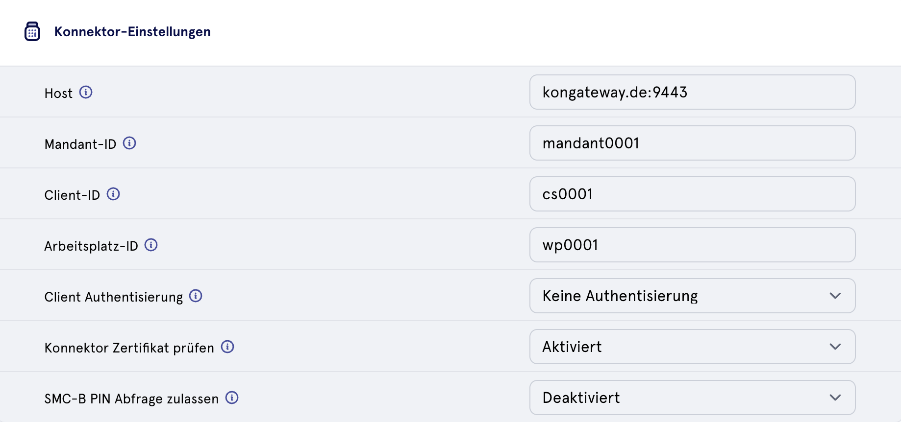

# Authenticator Proxy

## Einleitung

Die Authenticator-App ist eine Client-Anwendung, die in Krankenhäusern und Arztpraxen zum Einsatz kommt. Für den Authentifizierungsprozess benötigen wir in all diesen Fällen einen Konnektor und eine Smartcard. Der Konnektor verfügt jedoch über eine geschützte API. Die entsprechenden Anmeldedaten werden von einem Aufrufer benötigt, in unserem Fall von der Authenticator-App.

Dies wirft einige Probleme auf, da für die Anmeldedaten der Konnektor-API hohe Schutzmaßnahmen erforderlich sind. Außerdem müssen diese Anmeldedaten an dezentrale Client-Apps verteilt werden, wodurch sich neue Angriffsvektoren eröffnen könnten.

Die Verteilung der Anmeldeinformationen für den Konnektor birgt Risiken für die Vertraulichkeit. Mit diesem Authenticator Proxy werden die Credentials an einen zentralen Ort verlagert, wo sie effektiv geschützt und viel einfacher verteilt werden können. Zudem werden die erlaubten Anfragen an den Konnektor auf die notwendigen Teile der Konnektor-API beschränkt.

## Reverse-Proxy

Ein Reverse-Proxy sollte die APIs und die Struktur der Konnektor-Entitäten abstrahieren. Er nimmt Anfragen von Client-Rechnern entgegen und leitet sie abhängig von bestimmten Informationen in der Anfrage an einen Konnektor weiter. Zudem beendet er die TLS-Verbindung und baut eine neue mit mTLS gegen den eigentlichen Konnektor auf.

### Zertifikate

Zertifikate sind ein wichtiger Bestandteil des Sicherheitsmodells. Sie müssen jedoch richtig verwendet werden. Beim Aufbau der TLS-Verbindung validiert die Authenticator-App das von der Konnektor-API vorgelegte Zertifikat. Die Validierung erfolgt anhand einer Reihe von Stammzertifikaten, die entweder im Betriebssystem gespeichert sind oder in der Authenticator-Konfiguration bereitgestellt werden. Bei der Verwendung einer benutzerdefinierten PKI oder von selbst signierten Zertifikaten muss unter Umständen die Konfiguration der Unterzeichner- oder Zwischenzertifikate auf den Client-Rechnern vorgenommen werden.

## Einstellungen

### Konnektor-Einstellungen

### Konnektor Gateway

### Beispiel

[source,json]
----
include::docs/examples/config.json[]
----